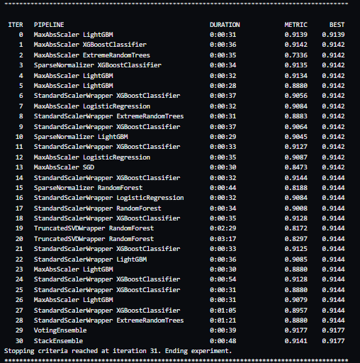

# Optimizing an ML Pipeline in Azure

## Overview
This project is part of the Udacity Azure ML Nanodegree. In this project, we build and optimize an Azure ML pipeline using the Python SDK and AutoML through provided Scikit-learn model on banking dataset available "https://automlsamplenotebookdata.blob.core.windows.net/automl-sample-notebook-data/bankmarketing_train.csv" This Python SDK model is then compared to an Azure AutoML run.

## Summary
This dataset contains marketing data about individuals. The classification goal is to predict if the client will subscribe to a term or not. The dataset consists of 20 input variables and 32,950 rows with 3,692 positive and 29,258 negative classes. It has multiple columns(i.e. age, marital status, dafault, loan and occupations e.t.c). It consists categorical and numerical variables. We utilized one hot encoding within the dataset for encoding categorical variables. For sampling the hyperparameter space we chose to utilize **Random Sampling** which supports discrete and continuous hyperparameters and then **Bandit Policy** of early stopping is used. In utilizing Random Sampling - hyperparameter values are randomly selected from the defined search space and utilized. There is a very large imbalance between positive and negative classes. This has certainly promote bias within the model. 

## Scikit-learn Pipeline
We use the Logistic Regression algorithm from Sci-KitLearn in conjunction with HyperDrive for hyperameter tuning. The pipeline consists of the following steps:

1. Data Collection
2. Data Cleansing
3. Test - Train - Split
4. Hyperparameter Sampling
5. Model Training
6. Model Testing
7. Activating Early Policy Stopping Evaluation
8. Saving the Model

#The execution of the pipeline is managed by HyperDrive. A brief description of each step is provided. 

## Data Collection

A Dataset is collected from the link  provided above using TabularDatasetFactory as it is in the form of csv.

## Data Cleansing

This process involves dropping rows with empty values (Nan) and one hot encoding the datset (for training) for the categorical columns.

## Data Splitting

Datasets are split into train and test sets. The splitting of a dataset is helpful to validate/fine-tune the model. The data is splitted in 75% training and remaining 25% for testing.

## Hyperparameter Sampling

Hyperparamters are adjustable parameters that let you control the model training process.

There are two hyperparamters for this experiment, --C and --max_iter. --C is the Inverse of regularization strength. Smaller values cause stronger regularization for the Sci-KitLearn Logistic Regression model.--max_iter is maximum numbers of iterations to converge.

We used random parameter sampling to sample over discrete sets of value. Random parameter sampling is great for discovery learning as well as hyperparameter combinations though it requires more time to execute.

## Model Training

Once we have split our dataset into test and training data, selected hyperparameters then we can train our model. This is known as model fitting.

## Model Testing

The test dataset is split and used to test the trained model. We have defined maximum runs to 15 cinsidering the time constraints in VM machine. Metrics are generated and logged and then used to benchmark the model. In this case, utilizing the accuracy as a model performance benchmark.

## Activating Early Policy Stopping Evaluation

The metric from model testing is evaluated using HyperDrive early stopping policy. The execution of the pipeline is stopped if conditions specified by the policy are met. 

We have used the BanditPolicy in our model. This policy is based on slack factor/slack amount compared to the best performing run. This helps to improve computational efficiency. 

## Saving the Model

The trained model is then saved with **0.907** with best run ID **HD_5224b8d5-2019-497f-aa94-4104f593440f_2**, which is important if you want to deploy the model or use it in some other experiments.

## AutoML

AutoML uses the provided dataset to fit on a wide variety of algorithms. It supports classification, regression and time-series forecasting problem sets. The exit criteria is specified in order to stop the training which ensures the resources are not used once the objectives are met. This helps save on costs. Due to the fact that we were utilize a Udacity Virtual Machine for Azure we could only specify a length of 30 minutes for an experiment prior to it timing out. However we were able to iterate through the following model pipelines (with their results):
                                       

As you can observe many of the models were in the range 0.8-0.9, however at the end the the best algorithm ended up being the VotingEnsemble at an accuracy of 0.91772 with primary metric **accuracy** with best run ID **AutoML_c07ec4f2-bdbe-4a9f-bc3e-4e9cb04a293**.

## Pipeline comparison
In conclusion the model generated by AutoML had a slightly higher accuracy than the HyperDrive Model. One of AutoML's best model accuracy was MaxAbsScalerXGBoostClassifier at 0.91772 and the HyperDrive Model accuracy was 0.907 with best run ID 
**HD_5224b8d5-2019-497f-aa94-4104f593440f_2**. The HyperDrive architecture was restricted to Logistic Regression from Sci-KitLearn. The AutoML has a wide variety of models it could evaluate - somewhere in the neighborhood of 20 models. HyperDrive is definitely at a disadvantage when it comes to going up against AutoML due to the fact that AutoML has upwards of 20 models to select from during an experiment.

## Future work

Future work may include improvements for HyperDrive. You could utilize Bayesian Parameter Sampling instead which works utilizing Markov Chain Monte Carlo methods for sampling a probability distribution. 

Improvements to AutoML may include channging the experiment timeout which would allow for more model experimentation. We could also address the class imbalance within the datset as well. This would help in reducing model bias. 
